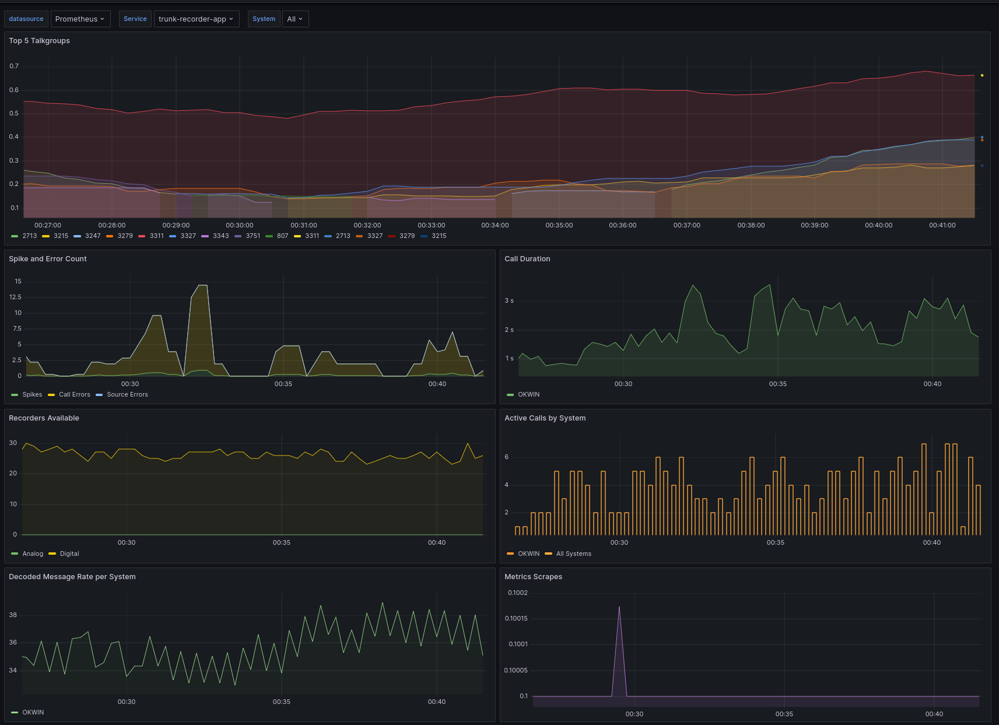

# Trunk Recorder Prometheus Plugin

This is a plugin for Trunk Recorder that publishes metrics in Prometheus format.

## Grafana Dashboard

A Grafana dashboard is available [here](https://grafana.com/grafana/dashboards/19959) and also in the `grafana/dashboard.json` file in this repository.

### Image

<details>
<summary>Dashboard Screenshot</summary>


</details>

## Install

1. **Build and install the current version of Trunk Recorder** following these [instructions](https://github.com/robotastic/trunk-recorder/blob/master/docs/INSTALL-LINUX.md). Make sure you do a `sudo make install` at the end to install the Trunk Recorder binary and libaries systemwide. The plugin will be built against these libraries.

1. Now, **install the prometheus-cpp Library**. The full documentation for that is [here](https://github.com/jupp0r/prometheus-cpp)... but the basic commands are as follows:

```bash
git clone https://github.com/jupp0r/prometheus-cpp.git
cd prometheus-cpp

# fetch third-party dependencies
git submodule init
git submodule update

mkdir _build
cd _build

# run cmake
cmake .. -DBUILD_SHARED_LIBS=ON -DENABLE_PUSH=OFF -DENABLE_COMPRESSION=ON

# build
cmake --build . --parallel 4

# run tests
ctest -V

# install the libraries and headers
cmake --install .
```

3. Build and install the plugin:

```bash
mkdir build
cd build
cmake ..
sudo make install
```

## Configure

| Key       | Required | Default Value | Type     | Description                                                  |
| --------- | :------: | ------------- | -------- | ------------------------------------------------------------ |
| port      |          | 9842          | uint16_t | The port to listen on for HTTP requests                      |

### Plugin Object Example

See the included [config.json](./config.json) as an example of how to load this plugin.

```yaml
    "plugins": [
    {
        "name": "prometheus",
        "library": "libprometheus_plugin.so",
        "port": 9842
    }]
```

## Docker

The included Dockerfile will allow buliding a trunk-recorder docker image with this plugin included.

`docker-compose` can be used to automate the build and deployment of this image. In the Docker compose file replace the image line with a build line pointing to the location where this repo has been cloned to.

Docker compose file:

```yaml
version: '3'
services:
  recorder:
    build: ./trunk-recorder-prometheus
    container_name: trunk-recorder
    restart: always
    privileged: true
    volumes:
      - /dev/bus/usb:/dev/bus/usb
      - /var/run/dbus:/var/run/dbus
      - /var/run/avahi-daemon/socket:/var/run/avahi-daemon/socket
      - ./:/app
```
